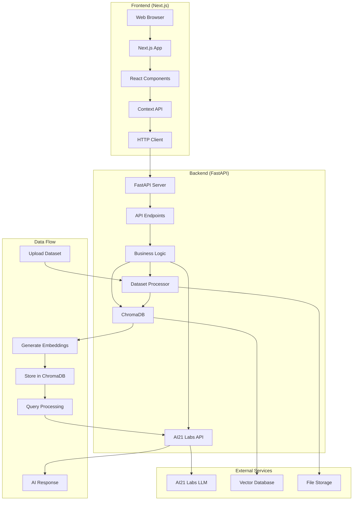
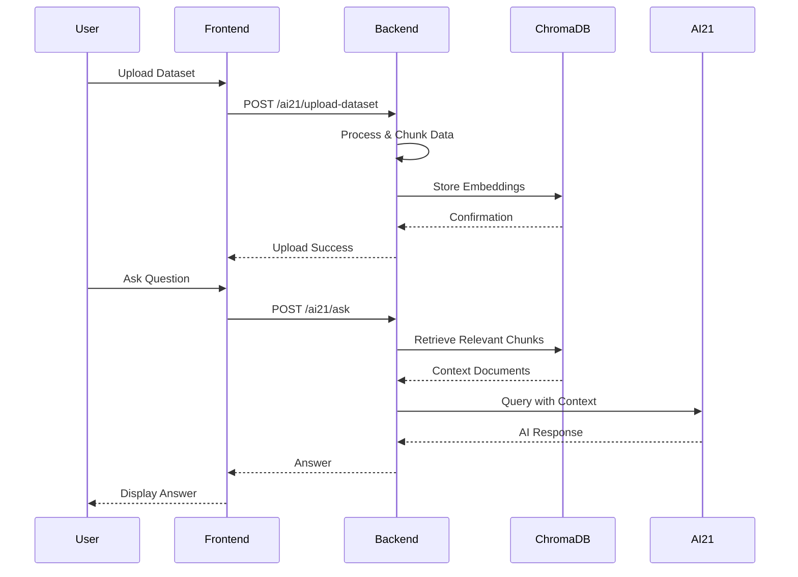
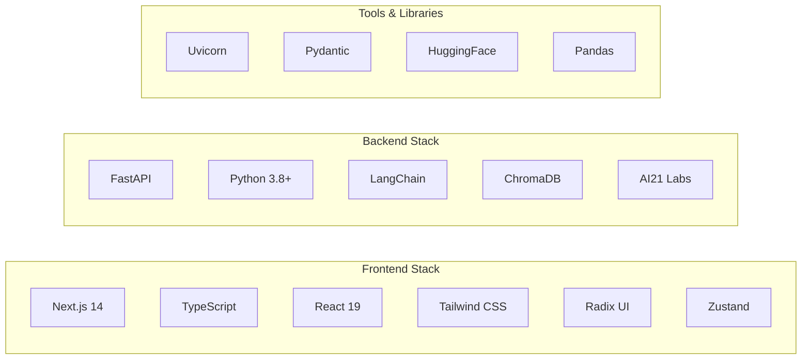
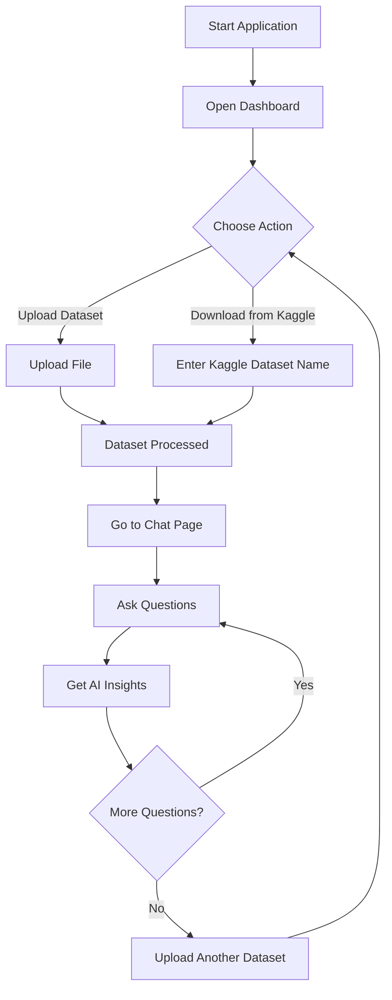

# DATAmat - AI-Powered Exploratory Data Analysis Platform

<div align="center">


**Transform your data analysis workflow with AI-powered insights**

[](https://www.python.org/)
[](https://nextjs.org/)
[](https://fastapi.tiangolo.com/)
[](https://www.typescriptlang.org/)

[Features](#-features) • [Quick Start](#-quick-start) • [Documentation](#-documentation) • [API Reference](#-api-reference)

</div>

---

## 📋 Table of Contents

- [Overview](#-overview)
- [Features](#-features)
- [Architecture](#-architecture)
- [Prerequisites](#-prerequisites)
- [Installation](#-installation)
- [Configuration](#-configuration)
- [Running the Application](#-running-the-application)
- [Usage Guide](#-usage-guide)
- [API Reference](#-api-reference)
- [Project Structure](#-project-structure)
- [Troubleshooting](#-troubleshooting)
- [Contributing](#-contributing)
- [License](#-license)

---

## 🎯 Overview

**DATAmat** is a modern, full-stack application that automates Exploratory Data Analysis (EDA) using AI21 Labs' powerful language models. Upload your datasets, ask natural language questions, and get instant insights—no coding required.

### What Makes DATAmat Special?

- 🤖 **AI-Powered Analysis**: Uses AI21 Labs Jamba model for intelligent data interpretation
- 📊 **Multi-Format Support**: Handles CSV, PDF, JSON, TXT, Excel files seamlessly
- 🔄 **Real-Time Processing**: Instant Q&A responses with vector-based retrieval
- 🌐 **Kaggle Integration**: Download datasets directly from Kaggle
- 💻 **Modern UI**: Clean, responsive interface built with Next.js and Tailwind CSS
- 🔍 **Vector Search**: ChromaDB-powered semantic search for accurate answers

---

## ✨ Features

### Core Capabilities

- **📤 Dataset Upload**: Drag-and-drop or file picker for multiple file formats
- **💬 Interactive Q&A**: Natural language questions about your data
- **📥 Kaggle Downloads**: Direct integration with Kaggle datasets
- **📚 Dataset Management**: View, manage, and switch between datasets
- **🏥 Health Monitoring**: Real-time backend connection status
- **📱 Responsive Design**: Works seamlessly on desktop and tablet

### Supported File Formats

- **CSV** (`.csv`) - Comma-separated values
- **Excel** (`.xlsx`, `.xls`) - Microsoft Excel files
- **PDF** (`.pdf`) - Portable Document Format
- **JSON** (`.json`) - JavaScript Object Notation
- **Text** (`.txt`) - Plain text files

---

## 🏗️ Architecture

### System Architecture



### Request Flow



### Technology Stack



---

## 📦 Prerequisites

Before you begin, ensure you have the following installed:

### Required Software

- **Python 3.8+** - [Download Python](https://www.python.org/downloads/)
- **Node.js 18+** - [Download Node.js](https://nodejs.org/)
- **pnpm** (recommended) or **npm** - [Install pnpm](https://pnpm.io/installation)
- **Git** - [Download Git](https://git-scm.com/downloads)

### Required Accounts & API Keys

- **AI21 Labs API Key** - Get your free API key from [AI21 Labs](https://www.ai21.com/)
- **Kaggle API** (optional) - For Kaggle dataset downloads
  - Create account at [Kaggle](https://www.kaggle.com/)
  - Download `kaggle.json` from your account settings

### System Requirements

- **RAM**: 4GB minimum (8GB recommended for large datasets)
- **Storage**: 2GB free space
- **OS**: Windows 10+, macOS 10.15+, or Linux

---

## 🚀 Installation

### 1. Clone the Repository

```bash
git clone <repository-url>
cd Datamat-Automating-EDA
```

### 2. Backend Setup

#### Create Virtual Environment

```bash
# Windows
python -m venv venv
venv\Scripts\activate

# macOS/Linux
python3 -m venv venv
source venv/bin/activate
```

#### Install Dependencies

```bash
pip install -r requirements.txt
```

#### Create Datasets Directory

```bash
mkdir datasets
```

> **Note**: The server will automatically create this directory, but creating it beforehand ensures proper permissions.

### 3. Frontend Setup

```bash
cd frontend
pnpm install
# or
npm install
```

---

## ⚙️ Configuration

### Backend Configuration

#### 1. Set Environment Variables

Create a `.env` file in the project root (or set system environment variables):

**Windows PowerShell:**
```powershell
$env:AI21_API_KEY="your-ai21-api-key-here"
```

**Windows CMD:**
```cmd
set AI21_API_KEY=your-ai21-api-key-here
```

**macOS/Linux:**
```bash
export AI21_API_KEY="your-ai21-api-key-here"
```

For persistent configuration, create a `.env` file:
```env
AI21_API_KEY=your-ai21-api-key-here
```

#### 2. Kaggle API Setup (Optional)

For Kaggle dataset downloads:

1. Go to [Kaggle Account Settings](https://www.kaggle.com/settings)
2. Scroll to "API" section
3. Click "Create New Token" to download `kaggle.json`
4. Place the file in your home directory:
   - **Windows**: `C:\Users\<YourUsername>\.kaggle\kaggle.json`
   - **macOS/Linux**: `~/.kaggle/kaggle.json`

### Frontend Configuration

#### 1. Create Environment File

Create `frontend/.env.local`:

```env
NEXT_PUBLIC_BACKEND_URL=http://localhost:8001
```

> **Note**: Change the URL if your backend runs on a different port or host.

---

## 🏃 Running the Application

### Quick Start (Development Mode)

#### Terminal 1 - Start Backend

```bash
# Activate virtual environment (if not already activated)
# Windows
venv\Scripts\activate
# macOS/Linux
source venv/bin/activate

# Run the backend server
python run_backend.py
# OR
python -m uvicorn src.datamat.ai21lab_api:app --host 0.0.0.0 --port 8001 --reload
```

You should see:
```
✅ Requirements check passed!

🌐 Starting server on http://localhost:8001
📚 API docs will be available at http://localhost:8001/docs
```

#### Terminal 2 - Start Frontend

```bash
cd frontend
pnpm dev
# or
npm run dev
```

You should see:
```
  ▲ Next.js 14.2.25
  - Local:        http://localhost:3000
```

### Verify Installation

1. **Check Backend Health**:
   ```bash
   curl http://localhost:8001/ai21/health
   ```
   Expected response:
   ```json
   {"status":"healthy","backend":"ai21"}
   ```

2. **Open Frontend**:
   Navigate to [http://localhost:3000](http://localhost:3000)

3. **Check API Documentation**:
   Visit [http://localhost:8001/docs](http://localhost:8001/docs) for interactive API docs

### Production Build

#### Backend

```bash
# No build step needed - Python is interpreted
# Just ensure dependencies are installed
pip install -r requirements.txt
```

#### Frontend

```bash
cd frontend
pnpm build
pnpm start
# or
npm run build
npm start
```

---

## 📖 Usage Guide

### Getting Started Workflow



### Step-by-Step Tutorial

#### 1. Upload Your First Dataset


- Click **"Upload Dataset"** in the navigation
- Drag and drop your file or click to select
- Supported formats: CSV, PDF, JSON, TXT, XLSX, XLS
- Wait for the success message

#### 2. Ask Questions About Your Data


- Navigate to **"Ask Questions"** page
- Type your question in natural language, for example:
  - "What are the main columns in this dataset?"
  - "Show me the data distribution"
  - "What are the key statistics?"
  - "Are there any missing values?"
- Press Enter or click Send
- View the AI-generated response

#### 3. Download from Kaggle


- Go to **"Kaggle Download"** page
- Enter dataset name in format: `username/dataset-name`
- Click **"Download Dataset"**
- Wait for download completion
- The dataset will be automatically processed

#### 4. Manage Datasets


- View all uploaded datasets in **"Datasets"** page
- See file size, upload date, and other metadata
- Select active dataset for Q&A sessions
- Refresh list to see latest uploads

---

## 🔌 API Reference

### Base URL

```
http://localhost:8001
```

### Endpoints

#### Health Check

```http
GET /ai21/health
```

**Response:**
```json
{
  "status": "healthy",
  "backend": "ai21"
}
```

**Error Response (503):**
```json
{
  "detail": "Service unhealthy: AI21_API_KEY not found"
}
```

---

#### Ask Question

```http
POST /ai21/ask
Content-Type: application/json
```

**Request Body:**
```json
{
  "question": "What are the main columns in this dataset?"
}
```

**Response:**
```json
{
  "answer": "The dataset contains the following columns: id, name, age, email..."
}
```

**Error Response (500):**
```json
{
  "detail": "Error processing question: QA chain not initialized. Please upload a dataset first."
}
```

---

#### Upload Dataset

```http
POST /ai21/upload-dataset
Content-Type: multipart/form-data
```

**Request:**
- `file`: File upload (form-data)

**Response:**
```json
{
  "message": "Dataset uploaded and processed successfully",
  "filename": "20240101_120000_example.csv",
  "path": "datasets/20240101_120000_example.csv",
  "size_bytes": 102400
}
```

**Error Response (500):**
```json
{
  "detail": "Error uploading dataset: Unsupported file type"
}
```

---

#### List Datasets

```http
GET /ai21/list-datasets
```

**Response:**
```json
{
  "datasets": [
    {
      "filename": "20240101_120000_example.csv",
      "size_bytes": 102400,
      "created": "2024-01-01T12:00:00"
    }
  ]
}
```

---

#### Download Kaggle Dataset

```http
POST /ai21/download-kaggle-dataset
Content-Type: application/json
```

**Request Body:**
```json
{
  "dataset_name": "username/dataset-name",
  "filename": "optional-custom-name"
}
```

**Response:**
```json
{
  "message": "Kaggle dataset downloaded successfully",
  "dataset": "username/dataset-name",
  "files": ["train.csv", "test.csv"],
  "download_path": "datasets/kaggle/username_dataset-name"
}
```

**Error Responses:**

- **400** - Invalid dataset format or missing Kaggle credentials
- **500** - Download or processing error

---

### Interactive API Documentation

Visit [http://localhost:8001/docs](http://localhost:8001/docs) for Swagger UI documentation with:
- Interactive endpoint testing
- Request/response schemas
- Authentication details
- Try-it-out functionality

---

## 📁 Project Structure

```
Datamat-Automating-EDA/
│
├── frontend/                    # Next.js frontend application
│   ├── app/                    # Next.js App Router
│   │   ├── layout.tsx          # Root layout
│   │   ├── page.tsx            # Home page
│   │   └── globals.css         # Global styles
│   │
│   ├── components/             # React components
│   │   ├── chat-page.tsx       # Q&A interface
│   │   ├── dashboard-page.tsx  # Dashboard
│   │   ├── upload-page.tsx     # File upload
│   │   ├── kaggle-page.tsx     # Kaggle download
│   │   ├── datasets-page.tsx   # Dataset management
│   │   ├── navigation.tsx     # Navigation bar
│   │   └── ui/                 # shadcn/ui components
│   │
│   ├── lib/                    # Utilities and context
│   │   ├── datamat-context.tsx # Global state management
│   │   └── utils.ts            # Helper functions
│   │
│   ├── hooks/                  # Custom React hooks
│   │   └── use-datamat-init.ts # Initialization hook
│   │
│   ├── public/                 # Static assets
│   ├── package.json            # Frontend dependencies
│   └── .env.local              # Frontend environment variables
│
├── src/                        # Python backend source
│   └── datamat/
│       ├── ai21lab_api.py      # FastAPI application
│       ├── ai21labs_utils.py   # QA chain setup
│       ├── logger.py           # Logging configuration
│       └── logging_config.py   # Log setup
│
├── datasets/                   # Uploaded datasets (auto-created)
├── chroma_db/                  # Vector database (auto-created)
├── log/                        # Application logs (auto-created)
│
├── requirements.txt            # Python dependencies
├── run_backend.py              # Backend startup script
├── setup.py                     # Python package setup
├── .env                        # Backend environment variables (create this)
└── README.md                   # This file
```

---

## 🔧 Troubleshooting

### Common Issues

#### Backend Won't Start

**Problem**: Server fails to start with import errors

**Solution**:
```bash
# Ensure virtual environment is activated
# Reinstall dependencies
pip install --upgrade -r requirements.txt
```

---

#### AI21_API_KEY Not Found

**Problem**: `Error: AI21_API_KEY not found`

**Solution**:
```bash
# Windows PowerShell
$env:AI21_API_KEY="your-key-here"

# Verify it's set
echo $env:AI21_API_KEY

# Windows CMD
set AI21_API_KEY=your-key-here

# macOS/Linux
export AI21_API_KEY="your-key-here"
echo $AI21_API_KEY
```

---

#### Frontend Can't Connect to Backend

**Problem**: Frontend shows "Backend Not Connected"

**Solutions**:
1. Verify backend is running on port 8001
2. Check `frontend/.env.local` has correct URL:
   ```env
   NEXT_PUBLIC_BACKEND_URL=http://localhost:8001
   ```
3. Check for CORS errors in browser console
4. Verify firewall isn't blocking port 8001

---

#### QA Chain Not Initialized

**Problem**: "QA chain not initialized. Please upload a dataset first"

**Solution**:
1. Upload at least one dataset file
2. Ensure file is in supported format (CSV, PDF, JSON, TXT, XLSX, XLS)
3. Check `datasets/` directory contains files
4. Restart backend after upload

---

#### Port Already in Use

**Problem**: `Address already in use` error

**Solution**:
```bash
# Windows - Find process using port 8001
netstat -ano | findstr :8001

# Kill the process (replace PID with actual process ID)
taskkill /PID <PID> /F

# macOS/Linux
lsof -ti:8001 | xargs kill -9
```

---

#### Kaggle Download Fails

**Problem**: "Kaggle API credentials not found"

**Solution**:
1. Download `kaggle.json` from Kaggle account settings
2. Place in home directory:
   - **Windows**: `C:\Users\<YourUsername>\.kaggle\kaggle.json`
   - **macOS/Linux**: `~/.kaggle/kaggle.json`
3. Ensure proper permissions:
   ```bash
   # macOS/Linux
   chmod 600 ~/.kaggle/kaggle.json
   ```

---

#### Large File Upload Fails

**Problem**: Upload times out or fails for large files

**Solution**:
- Backend has default timeout limits
- Consider chunking very large files
- Check available RAM and disk space
- Monitor logs in `log/` directory

---

### Debug Mode

#### Enable Verbose Logging

**Backend**: Logs are automatically written to `log/` directory with timestamps

**Frontend**: Check browser console (F12) for errors and network requests

#### Test Backend Health

```bash
# Using curl
curl http://localhost:8001/ai21/health

# Using PowerShell
Invoke-WebRequest -Uri http://localhost:8001/ai21/health

# Using Python
python -c "import requests; print(requests.get('http://localhost:8001/ai21/health').json())"
```

---

## 🎨 Screenshots & Demo

> **Note**: Add your screenshots/GIFs to `docs/` directory

### Dashboard


### Chat Interface


### Upload Page


### Dataset Management


---

## 🤝 Contributing

We welcome contributions! Please follow these steps:

1. Fork the repository
2. Create a feature branch (`git checkout -b feature/amazing-feature`)
3. Commit your changes (`git commit -m 'Add amazing feature'`)
4. Push to the branch (`git push origin feature/amazing-feature`)
5. Open a Pull Request

### Development Guidelines

- Follow PEP 8 for Python code
- Use TypeScript for frontend code
- Write meaningful commit messages
- Add tests for new features
- Update documentation as needed

---

## 📝 License

This project is licensed under the MIT License - see the LICENSE file for details.

---

## 🙏 Acknowledgments

- [AI21 Labs](https://www.ai21.com/) for powerful LLM capabilities
- [FastAPI](https://fastapi.tiangolo.com/) for the excellent web framework
- [Next.js](https://nextjs.org/) for the React framework
- [LangChain](https://www.langchain.com/) for LLM orchestration
- [ChromaDB](https://www.trychroma.com/) for vector storage

---

## 📞 Support

- **Issues**: [GitHub Issues](https://github.com/your-repo/issues)
- **Discussions**: [GitHub Discussions](https://github.com/your-repo/discussions)
- **Email**: support@datamat.example.com

---

## 🔮 Roadmap

- [ ] Multi-user support with authentication
- [ ] Advanced visualization capabilities
- [ ] Export analysis reports (PDF, HTML)
- [ ] Real-time collaboration features
- [ ] Custom AI model selection
- [ ] Database integration (PostgreSQL, MySQL)
- [ ] API rate limiting and usage analytics
- [ ] Docker containerization
- [ ] Kubernetes deployment guides

---

<div align="center">

**Made with ❤️ by the DATAmat Team**

[⬆ Back to Top](#-datamat---ai-powered-exploratory-data-analysis-platform)

</div>
